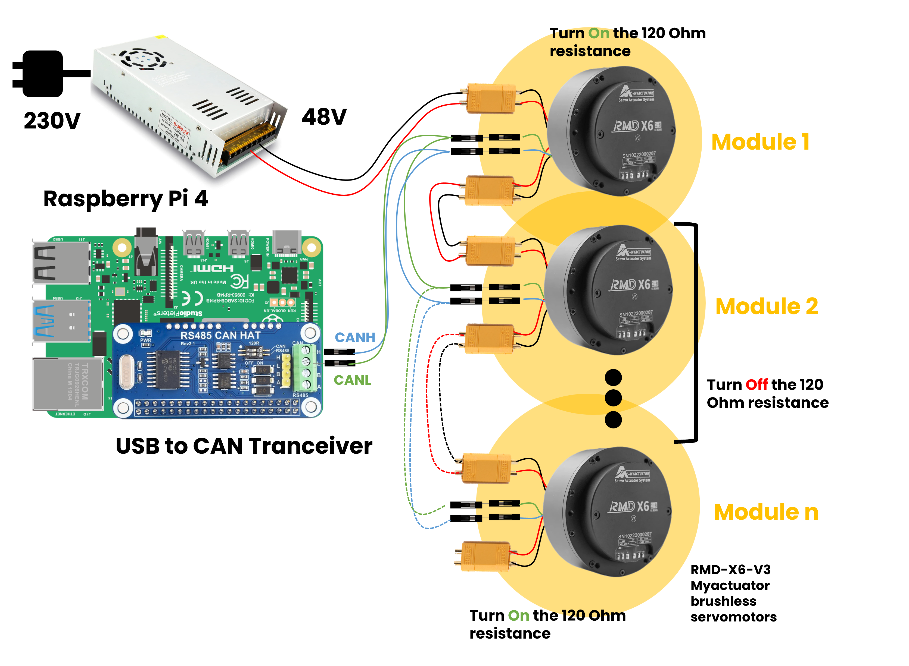
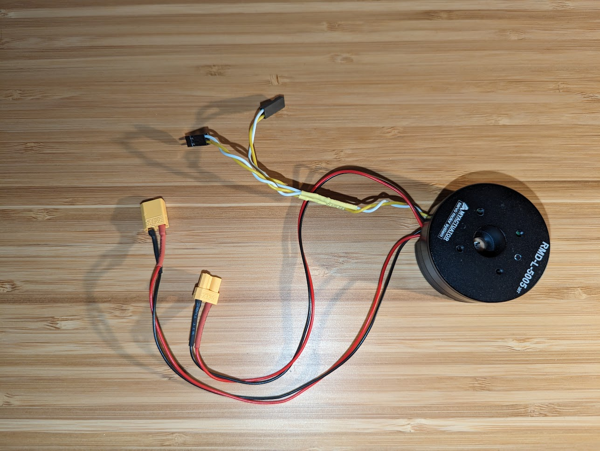

# Hardware

## Needs

### Boards
* [Raspberry Pi 4B 8Go](https://www.amazon.fr/Raspberry-Pi-RPI4-MODBP-8GB-mod%C3%A8les-Go/dp/B09TTKT94J/ref=sr_1_5?keywords=Raspberry+Pi+4B&qid=1695754703&sr=8-5)
* [USB to CAN converter module](https://www.amazon.fr/Converter-Raspberry-Computer-Support-Windows/dp/B09K3LL93Q) but [CAN Hat for Raspberry Pi](https://www.kubii.com/fr/modules-relais/2487-rs485-can-hat-pour-raspberry-pi-kubii-3272496014381.html) is better (future version)

### Actuators
* [CAN Myactuator RMD-X6 V3 brushless servomotors](https://www.myactuator.com/product-page/rmd-x6-1-8)
> **Mechanical features**
>   * No -load output Speed : 360 rpm
>   * Nominal output Speed : 310 rpm
>   * Nominal torque : 4.5 Nm
>   * Motor efficency : 78 %
>   * Motor weight : 490 g
>   * Reducer ratio 8:1
> 
> **Hardware features**
>   * Input voltage : 48 V
>   * Nominal current : 3.6 A
>   * Output Norminal power : 135 W
>   * Wire Resistance : 0.55 Ohm
>   * Wire inductance : 0.18 mH
> 
> **Software features**
>   * CAN BUS :500Kbps/ 1Mbps
>   * RS485 BUS : 115200/500K/1M/1.5K /2.5K
>   * Servo mode(Torque /Velocity/Position)
>   * Motion mode（feedforward torque/velocity/position)

### Cables
* [16AWG red & black cables](https://www.amazon.fr/%C3%A9lectrique-TUOFENG-R%C3%A9sistance-temp%C3%A9ratures-bricolage/dp/B08C2RL4RY/ref=sr_1_9?__mk_fr_FR=%C3%85M%C3%85%C5%BD%C3%95%C3%91&crid=3VO2TR851SMFR&keywords=tuofeng&qid=1695765817&sprefix=tuofeng%2Caps%2C83&sr=8-9&th=1)

### Connectors
* [XT60 connectors](https://www.amazon.fr/RUNCCI-connecteur-Connecteurs-Batterie-connecteurs/dp/B07N1N2C94/ref=sr_1_6?__mk_fr_FR=%C3%85M%C3%85%C5%BD%C3%95%C3%91&crid=11I1PV8CHBJWU&keywords=xt60+connectors&qid=1695755321&sprefix=xt60+connectros%2Caps%2C84&sr=8-6)
* [XT30 connectors](https://www.amazon.fr/AUTOUTLET-10Pairs-Connector-r%C3%A9tr%C3%A9cissement-Batterie/dp/B07CJ2Y739/ref=sr_1_4_sspa?crid=16ND3Z1QZDU4Q&keywords=xt30%2Bconnecteur&qid=1695765565&sprefix=XT30%2Caps%2C98&sr=8-4-spons&sp_csd=d2lkZ2V0TmFtZT1zcF9hdGY&th=1)
* [Banana Connectors](https://www.amazon.fr/Senven-profession-Connector-Speaker-Haut-parleur/dp/B07XP3NRR7/ref=sr_1_10?__mk_fr_FR=%C3%85M%C3%85%C5%BD%C3%95%C3%91&crid=CW72YHTZ1HL9&keywords=fiche+banane+a+sertir&qid=1695765910&sprefix=fiche+bannane+a+sertir%2Caps%2C78&sr=8-10)

### Power
#### Option 1 : Mobile version
* [6S lipo battery](https://www.amazon.fr/OVONIC-Connecteur-Quadcopter-Helicopter-Multi-Motor/dp/B07VPZH174/ref=sr_1_8?__mk_fr_FR=%C3%85M%C3%85%C5%BD%C3%95%C3%91&crid=2DNPW84VSV4S9&keywords=6s+batterie+lipo&qid=1695755927&sprefix=6s+batterie+lipo%2Caps%2C78&sr=8-8)
* [6S lipo battery charger](https://www.amazon.fr/Haisito-Chargeur-D%C3%A9chargeur-Batterie-Adaptateur/dp/B07SS4VWSS/ref=sr_1_4_sspa?__mk_fr_FR=%C3%85M%C3%85%C5%BD%C3%95%C3%91&crid=J6LFXAJ2L17B&keywords=6s+battery+lipo+charger&qid=1695756056&sprefix=6s+batterie+lipo+charger%2Caps%2C79&sr=8-4-spons&sp_csd=d2lkZ2V0TmFtZT1zcF9hdGY&psc=1)

#### Option 2 : Test version
* [Regulated power supply](https://www.amazon.fr/Alimentation-laboratoire-HANMATEK-contr%C3%B4lable-alimentation/dp/B07SS77N7K/ref=cm_cr_arp_d_product_top?ie=UTF8)

#### Option 3 : Stable version
* [24V power supply](https://www.amazon.fr/Alimentation-Transformateur-Convertisseur-Moniteur-Appareils/dp/B0BTBX3LZ2/ref=sr_1_18_sspa?keywords=alimentation+24V&qid=1695765228&sr=8-18-spons&sp_csd=d2lkZ2V0TmFtZT1zcF9tdGY&psc=1)

### Tools
* [Stripping plier](https://www.amazon.fr/KAIWEETS-Automatique-Coupante-Electricien-Multifonction/dp/B0BYNJDZK5/ref=sr_1_1_sspa?__mk_fr_FR=%C3%85M%C3%85%C5%BD%C3%95%C3%91&crid=38G8J4S51XIQJ&keywords=pince+a+denuder&qid=1695765365&sprefix=pince+a+d%C3%A9nuder%2Caps%2C89&sr=8-1-spons&sp_csd=d2lkZ2V0TmFtZT1zcF9hdGY&psc=1)
* [Crimping tool](https://www.amazon.fr/Sertir-Clique-isol%C3%A9es-Electriques-Automobile/dp/B0C6T3T41K/ref=sr_1_31?__mk_fr_FR=%C3%85M%C3%85%C5%BD%C3%95%C3%91&crid=IVNCF9THCK2N&keywords=pince+a+sertir&qid=1695765436&sprefix=pince+a+sertir%2Caps%2C90&sr=8-31)

## Electrical diagram of the project

**CAN Myactuator brushless servomotors with cables and XT30 connectors**

## More information about CAN protocol & CAN bus

### CAN protocol
CAN is short for ‘controller area network’. Controller area network is an electronic communication bus defined by the ISO 11898 standards. Those standards define how communication happens, how wiring is configured and how messages are constructed, among other things. Collectively, this system is referred to as a CAN bus.

### CAN messages
The CAN bus is a broadcast type of bus. This means that all nodes can ‘hear’ all transmissions. There is no way to send a message to just a specific node; all nodes will invariably pick up all traffic. The CAN hardware, however, provides local filtering so that each node may react only on the interesting messages.

**The CAN messages**
CAN uses short messages – the maximum utility load is 94 bits. There is no explicit address in the messages; instead, the messages can be said to be contents-addressed, that is, their contents implicitly determines their address.

**Message Types**
There are four different message types (or ‘frames’) on a CAN bus:
* the Data Frame
* the Remote Frame
* the Error Frame
* the Overload Frame

### CAN bus
The CAN bus uses Non-Return To Zero (NRZ) with bit-stuffing. There are two different signaling states: dominant (logically 0) and recessive (logically 1). These correspond to certain electrical levels which depend on the physical layer used (there are several.) The modules are connected to the bus in a wired-and fashion: if just one node is driving the bus to the dominant state, then the whole bus is in that state regardless of the number of nodes transmitting a recessive state.

The maximum speed of a CAN bus, according to the standard, is **1 Mbit/second**. Some CAN controllers will nevertheless handle higher speeds than 1Mbit/s and may be considered for special applications.

> Low-speed CAN (ISO 11898-3, see above) can go up to 125 kbit/s.
> Single-wire CAN can go up to around 50 kbit/s in its standard mode and, using a special high-speed mode used e.g. for ECU programming, up to around 100 kbit/s.

*For more informations about CAN protocol and CAN bus check the [well explain article by KVASER](https://www.kvaser.com/can-protocol-tutorial/)*
